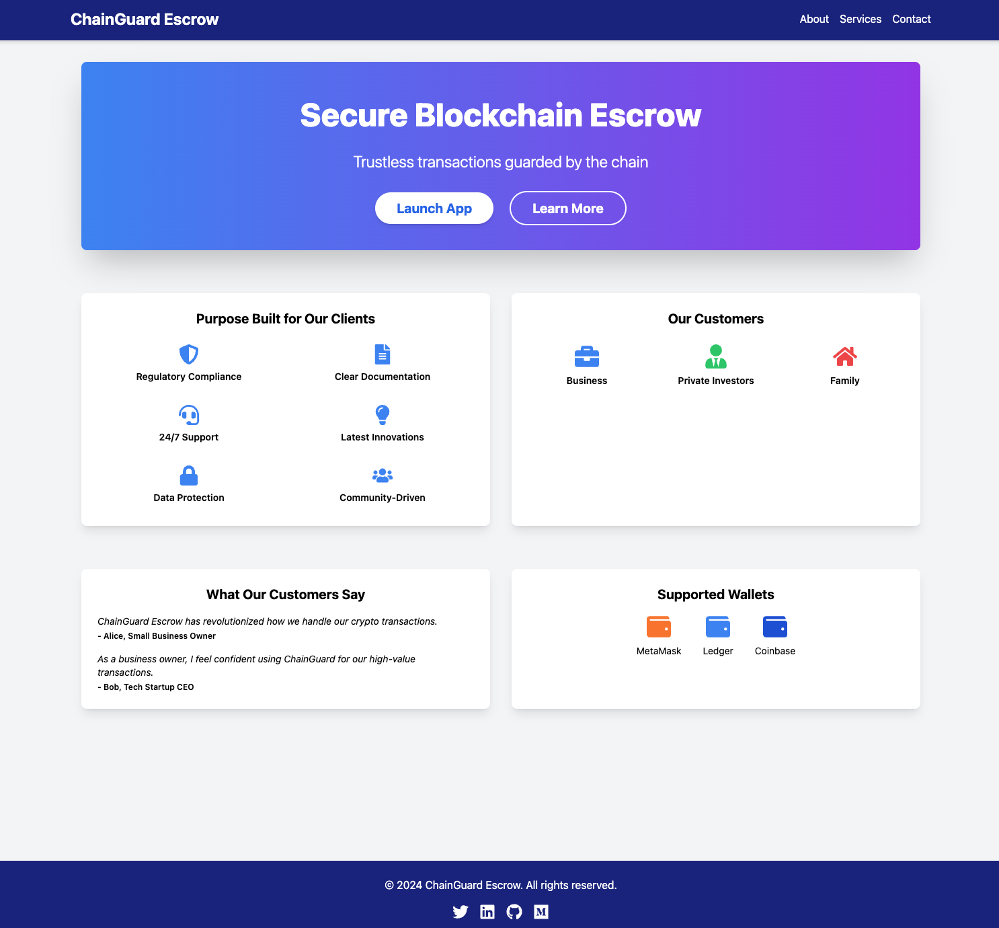

# ChainGuard Escrow

ChainGuard Escrow is a decentralized application (dApp) built on the Ethereum blockchain that provides a secure and transparent way to manage escrow transactions. It leverages smart contracts to automate the escrow process, ensuring trust and efficiency in digital transactions.

## Features

- Create escrow contracts with specified arbiter, beneficiary, and amount
- Approve escrow to release funds to the beneficiary
- Refund escrow to return funds to the depositor
- Real-time updates on escrow status
- Responsive design with smooth animations for an enhanced user experience

## Planned Features

- "Dead man's switch" custodial solution.
- Multisignature wallet

## Screenshot



## Prerequisites

Before you begin, ensure you have met the following requirements:

- Node.js (v14.0.0 or later)
- npm (v6.0.0 or later)
- EVM web3 browser wallet extension
- Some Sepolia testnet ETH for deploying contracts and making transactions

## Setup and Installation

1. Clone the repository:
   ```
   git clone https://github.com/yourusername/chainguard-escrow.git
   cd chainguard-escrow
   ```

2. Install dependencies:
   ```
   npm install
   ```

3. Create a `.env` file in the root directory and add your Sepolia RPC URL and private key:
   ```
   SEPOLIA_RPC_URL=your_sepolia_rpc_url
   PRIVATE_KEY=your_private_key
   ```

4. Compile the smart contracts:
   ```
   npx hardhat compile
   ```

5. Deploy the EscrowFactory contract to Sepolia:
   ```
   npx hardhat run scripts/deploy.js --network sepolia
   ```

6. Update the `factoryAddress` in `src/services/Web3Service.js` with the deployed EscrowFactory address.

7. Start the development server:
   ```
   npm start
   ```

## Usage

1. Connect your MetaMask wallet to the Sepolia testnet.
2. Click "Connect Wallet" in the app to connect your MetaMask account.
3. To create a new escrow:
   - Click "New Escrow"
   - Enter the arbiter address, beneficiary address, and amount
   - Click "Create Escrow"
4. To approve or refund an escrow:
   - Find the escrow in the list
   - Click "Approve" to release funds to the beneficiary
   - Click "Refund" to return funds to the depositor

## Technologies Used

- React.js
- Ethers.js
- Hardhat
- Solidity
- Framer Motion
- Tailwind CSS

## License

This project is licensed under the MIT License. See the [LICENSE](LICENSE) file for details.