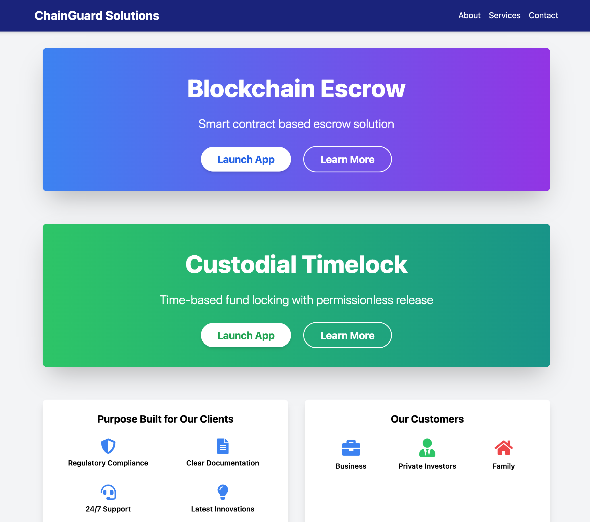
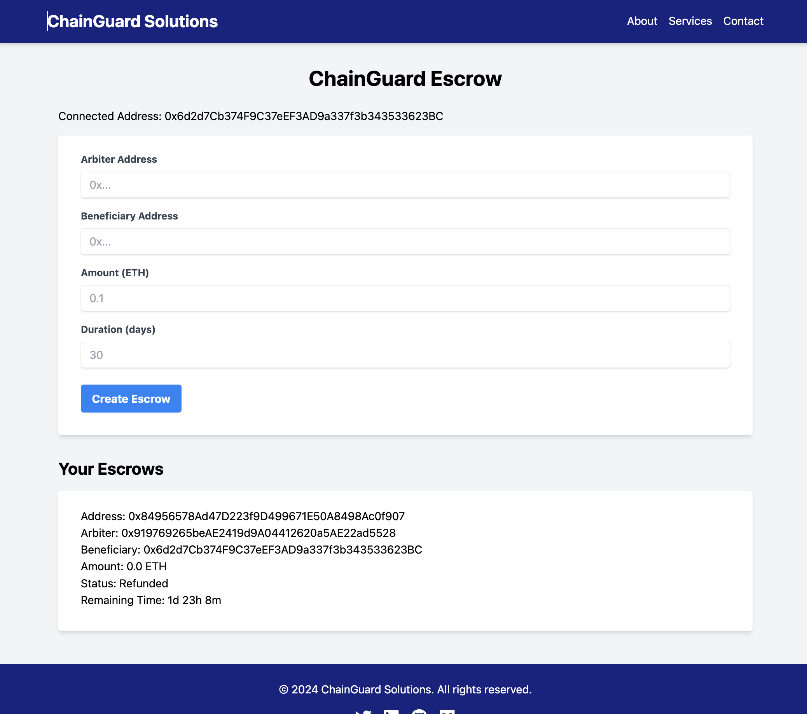
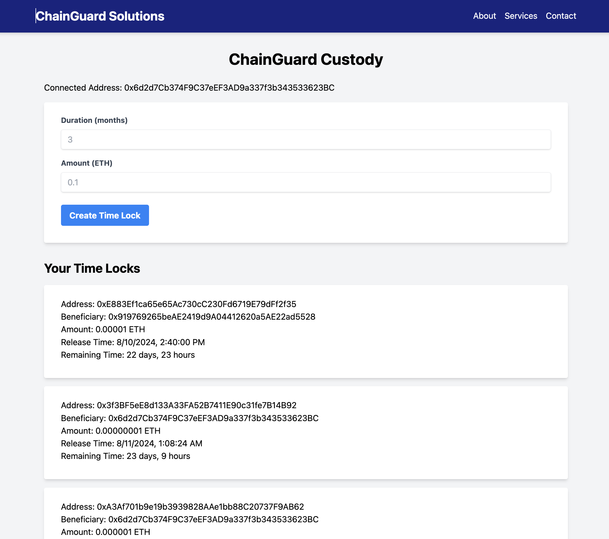

# ChainGuard

ChainGuard is a decentralized application built on the Ethereum blockchain that provides a secure and transparent way to manage escrow transactions. It leverages immutable smart contracts to automate the process, ensuring trust and efficiency in digital transactions.

ChainGuard is currently in development and is not yet ready for production use.

## Escrow Service

Used for creating escrow contracts with a specified arbiter, beneficiary, and amount. Use cases include escrow agreements, contractual agreements, or any other agreement where the arbiter is responsible for the release of funds to the beneficiary.

- Create escrow contracts with specified arbiter, beneficiary, and amount
- Approve escrow to release funds to the beneficiary
- Refund escrow to return funds to the depositor
- Real-time updates on escrow status

## Custody Service

Used for creating custody contracts with a specified beneficiary, amount, and duration. Use cases typically include vesting or trust distributions.

- Create custody contracts with specified beneficiary and amount
- Lock funds for a specified duration
- Release funds to the beneficiary after the duration has passed
- Real-time updates on custody status

## Screenshot




## Sepolia Deployment
- [EscrowFactory](https://sepolia.etherscan.io/address/0xe3668696460694c01d50c5a1ab56c6e17fa7feb5)
- [TimeLockFactory](https://sepolia.etherscan.io/address/0x3E23F35b523C61af24255F1F81db6A6E26FbAcac)


## Prerequisites
- EVM web3 browser wallet extension, such as Metamask or Coinbase wallet.
- Some Sepolia testnet ETH for deploying contracts and making transactions. Testnet ETH can be obtained from [Faucets](https://cloud.google.com/application/web3/faucet/ethereum/sepolia).

## Usage

1. Connect your MetaMask wallet to the Sepolia testnet.
2. Click "Connect Wallet" in the app to connect your MetaMask account.
3. To create a new escrow:
   - Click "New Escrow"
   - Enter the arbiter address, beneficiary address, and amount
   - Click "Create Escrow"
4. To approve or refund an escrow:
   - Find the escrow in the list
   - Click "Approve" to release funds to the beneficiary
   - Click "Refund" to return funds to the depositor
5. To create a new custody:
   - Click "New Custody"
   - Enter the beneficiary address and amount
   - Click "Create Custody"

## Local Development Setup

1. Clone the repository:
   ```
   git clone https://github.com/yourusername/chainguard-escrow.git
   cd chainguard-escrow
   ```

2. Install dependencies:
   ```
   npm install
   ```

3. Create a `.env` file in the root directory and add your Sepolia RPC URL and private key:
   ```
   SEPOLIA_RPC_URL=your_sepolia_rpc_url
   PRIVATE_KEY=your_private_key
   ```

4. Compile the smart contracts:
   ```
   npx hardhat compile
   ```

5. Deploy the EscrowFactory contract to Sepolia:
   ```
   npx hardhat run scripts/deploy.js --network sepolia
   ```

6. Update the `factoryAddress` in `src/services/Web3Service.js` with the deployed EscrowFactory address.

7. Start the development server:
   ```
   npm start
   ```

## Technologies Used

- React.js
- Ethers.js
- Hardhat
- Solidity
- Framer Motion
- Tailwind CSS

## License

This project is licensed under the MIT License. See the [LICENSE](LICENSE) file for details.